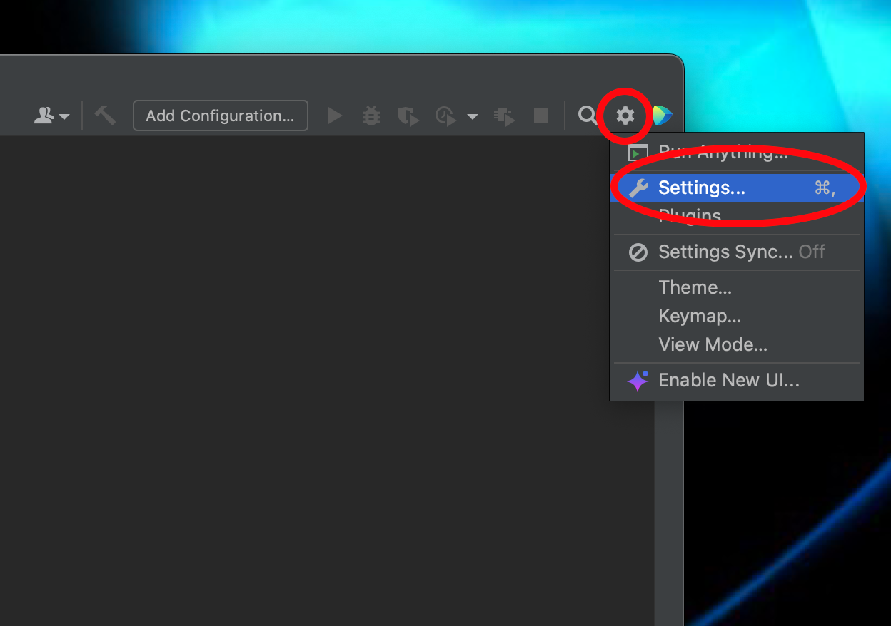
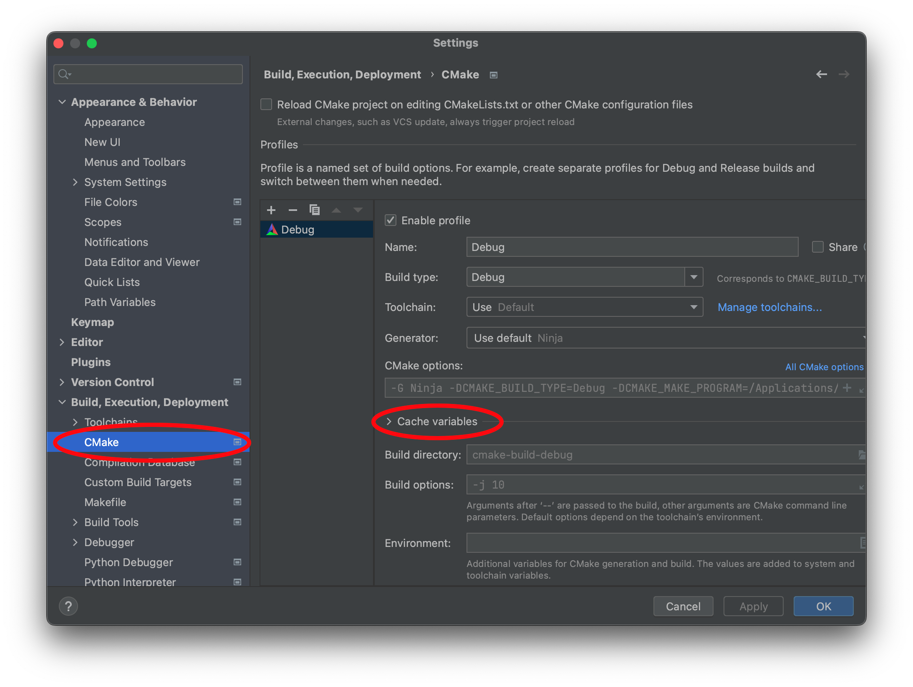
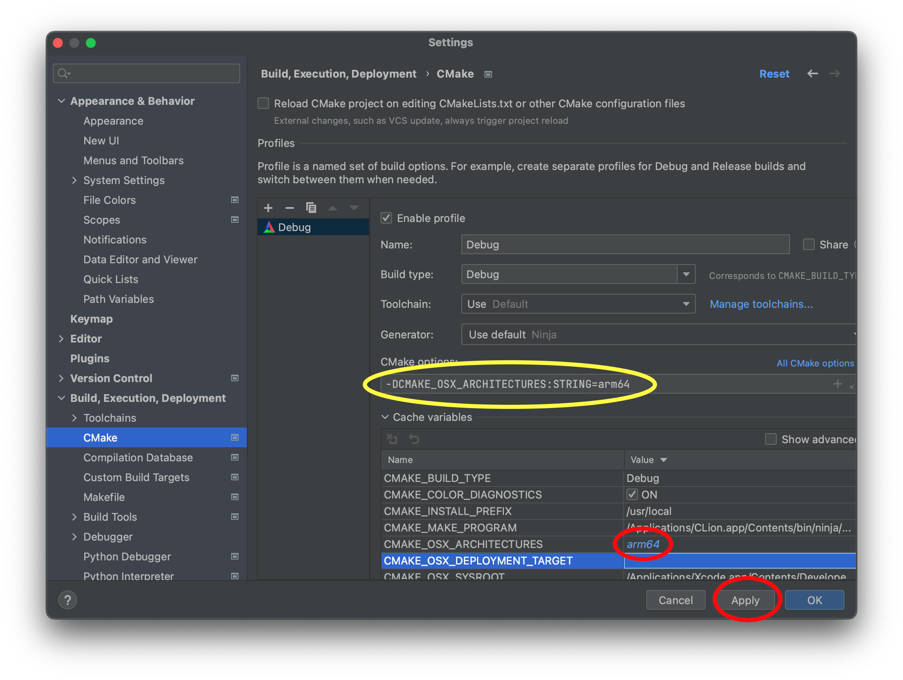

For this course, we will be using [CMake](https://cmake.org) to configure our build environment for proper compilation across different platforms. We will add each lab/assignment/exam as a subdirectory into a single project to allow all of the projects to be visible in the same IDE window.

## Getting Started

Download [CS370\_Fa24.zip](CS370_Fa24.zip), saving it into the directory where you plan on placing all your CS370 projects. **Note: BE SURE THE PATH DOES NOT CONTAIN ANY SPACES.**

Double-click on **CS370\_Fa24.zip** and extract the contents of the archive into a subdirectory called **CS370\_Fa24**

Open CLion, select **Open** from the main screen (you may need to close any open projects), and navigate to the **CS370\_Fa24** directory. This should open the project and execute the CMake script to configure the toolchain.

## Windows

In the popup dialog, in the **Toolchain** drop down select Visual Studio

> 

Then select **Manage toolchains**

> 

In the toolchain dialog, be sure Visual Studio is selected, then in the **Architecture:** dropdown, choose **amd64**

> 

Then click **OK** to exit the dialog boxes. This will set Visual Studio x64 as the compiler for all the projects we'll be importing into this project folder for this course.

Next select **File -> Settings** from the menubar.

> 

In the **Settings** dialog, select the **Tools->Terminal** option, then replace what is in the **Shell path:** setting with

    "C:\cygwin64\bin\sh" -lic 'cd "${OLDPWD-.}"; bash'

> 

If everything is configured correctly, when you select the **Terminal** tab in the lower left corner of CLion it should open up a terminal pane that displays a Cygwin prompt in the **CS370_Fa23** project directory.

> 

## Mac OSX

In the popup dialog, in the **Toolchain** drop down simply leave the default for Mac OSX which will use the XCode Clang compiler for all the projects we'll be importing into this project folder.

> 

Then click **OK** to exit the dialog boxes. CLion will simply use the built-in OSX Terminal application.

Next, in the upper-right corner, select the gear icon and **Settings** from the menubar.

> 

In the **Settings** dialog, select the **Build, Execution, Deployment->CMake** option, and expand the **Cache variables** section.

> 

Find the **CMAKE_OSX_ARCHITECTURE** variable name (which should have a blank value)

> 

Set this variable to the appropriate system processor as follows:

### Intel Mac

**If you have an Intel based Mac**

Set the **CMAKE_OSX_ARCHITECTURE** variable to **x86_64**, select the next box down which should add a CMake option flag **-DCMAKE_OSX_ARCHITECTURES:STRING=x86_64**. Click **Apply** and **OK** to close the dialog box.

> 

### Silicon Mac (M1, M2)

**If you have a Silcon based Mac**

Set the **CMAKE_OSX_ARCHITECTURE** variable to **arm64**, select the next box down which should add a CMake option flag **-DCMAKE_OSX_ARCHITECTURES:STRING=arm64**. Click **Apply** and **OK** to close the dialog box.

> 
