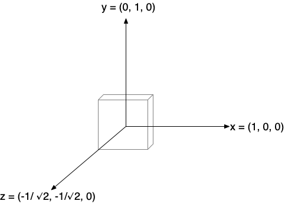
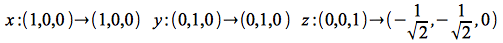
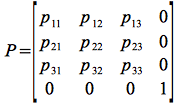
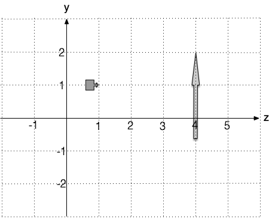
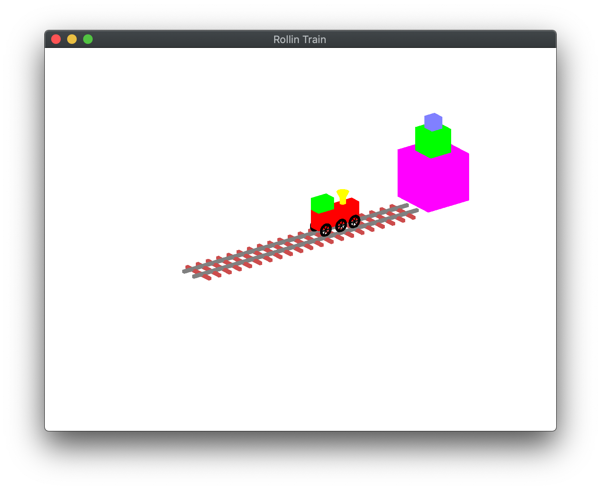
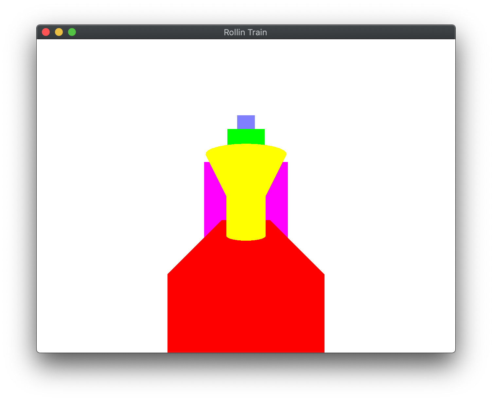

**Written Questions Due: Thursday, Sept 26th by 8:00 AM** (in class). Submit a **graded** pdf to Canvas by Sunday, Sept 24th.

**Program Due:**

**Milestone 1: Monday, Sept 23rd by 11:59 PM** 

**Milestone 2: Monday, Sept 30th by 11:59 PM** Late assignments will be penalized 20 points per day.

## Getting Started

Download [CS370\_Assign02\_Fa24.zip](src/CS370_Assign02_Fa24.zip), saving it into the **CS370\_Fa24** directory.

Double-click on **CS370\_Assign02\_Fa24.zip** and extract the contents of the archive into a subdirectory called **CS370\_Assign02\_Fa24**

Open CLion, select **CS370\_Fa24** from the main screen (you may need to close any open projects), and open the **CMakeLists.txt** file in this directory (**not** the one in the **CS370\_Assign02\_Fa24** subdirectory). Uncomment the line

```cpp
	add_subdirectory("CS370_Assign02_Fa24" "CS370_Assign02_Fa24/bin")
```

Finally, select **Reload changes** which should build the project and add **RollinTrain** to the dropdown menu at the top of the IDE window.

## Written Questions

1.  Typically when we draw 3D objects on paper (or the board) we draw the *x* and *y* axes at 90 degrees (*x* axis pointing right and *y* axis pointing up). We then represent the *z* axis (which would be coming out of the board) by a line at -135 degrees from the *x* axis (diagonally down towards the left). This type of projection is known as an *oblique* projection. Determine the projection matrix that would render the objects in this fashion.

	> 
	>
	> **Hint:** In order to achieve this projection, we need to find a *transformation matrix* that takes the standard axes and converts them as follows:
	>
    > 
    >
    > Use the above axis values to find the *rows* of a (homogeneous) transformation matrix by considering the matrix-vector products of the standard axes with the following generic projection matrix
    >
    > 

2. Given the following scene with the camera located at (x, 1, 1) looking at (x, 1, 2), sketch the viewing volume and determine the final size of the object in the rendered scene for the following projections (**Note:** the *x*-axis is ignored.) **Hint:** Use similar triangles to relate the relative sizes of the objects to the relative distances from the camera.

    > 

    > -  ortho(x, x, -1, 1, -1, 4)

    > -   frustum(x, x, -1, 1, 1, 4)

3.  Some of my research has been in the area of stereoscopic 3D images, which is now used extensively for VR. To create a stereoscopic 3D image, we simply render the scene from two different viewpoints (one to represent what the left eye would see and one to represent what the right eye would see) and then display the corresponding image to each eye using the VR headset. If the viewer is considered to be at the origin with an ocular spacing of Δ*x*, what are the appropriate **lookat()** functions to produce a stereo image pair? **Hint:** We need to render the scene from two different camera locations (separated by Δ*x*). Consider two possible locations where these cameras can be pointed, i.e. the **center** location, to produce a stereoscopic image.

## Programming assignment

Write a program that draws a 3D "train" scene using OpenGL. A sample executable is included in the **demo** directory as either **RollinTrainSolWin**, **RollinTrainSolMac-Intel**, or **RollinTrainSolMac-Silicon**. The scene should include:

-   A train with a body, engineer's compartment, smoke stack with funnel, six wheels spaced appropriately with spokes that rotate as the train moves.
-   A pair of tracks that have evenly spaced railroad ties below the tracks.
-   A stack of three blocks at the end of the tracks.
-   The key 'o' should select an orthographic "birds-eye" view above the scene that allows for the camera to be moved via spherical coordinates.
-   The keys 'w', 'a', 's', 'd' should rotate the camera along the azimuth and elevation angles.
-   The key 'p' should select a perspective "driver" view from the engineer's compartment that moves with the train to see the impending doom of the blocks approaching head on.
-   \<space\> should toggle the animation of the train going forward/backward down the track.
-   \<esc\> should quit the program.

*Hints:*

> Use the provided models for a cube, cylinder, torus, and cone to draw all the geometry. You will need to load the models from their respective files in **build\_geometry()**, a **load\_model()** function is provided in **utilfuncs.cpp**. The objects can then be rendered using the provided **draw\_color\_obj()** function also in **utilfuncs.cpp**.
>
> Create color buffer objects for each different colored primitive model shape you need, a **build\_solid\_color\_buffer()** function is provided in **utilfuncs.cpp**. **Note:** The first argument to this function is the *number of vertices* to make a color buffer for which can be retrieved for the objects from the *numVertices[]* array.
>
> Use instance transformations to build up more complex objects, e.g. tracks, by repeatedly rendering the template models with different transformations. Suggested symbolic constants for scale factors are provided in **RollinTrain.h**. The constants are interrelated as much as possible so that objects that are referenced off each other can be adjusted with a single value. **Develop the scene incrementally!** **Note:** You may want to make additional functions to draw the different parts of the scene, e.g. tracks, train, blocks, wheels, etc.
>
> An initial *orthographic* view from an *isometric* viewpoint, i.e. the camera positioned along a line going through (1,1,1) but far enough back to see the entire scene is provided. Consider changing the elevation angle to 90.0 and the azimuth angle to 0 (rear view) or 90 (side view) to help align things. Eventually, add spherical coordinate angles and adjust the camera parameters accordingly using WASD on the keyboard.
>
> For the *perspective* projection, consider where the camera should be located and where it should be looking at. **Note:** The location of this camera should *move* with the train.
>
> You'll probably want to have completely separate projection and camera setups for the different projection modes. A flag to toggle between the modes has been provided.

## Grading Criteria

**The program MUST compile to receive any credit** (so develop incrementally).

**Milestone 1** - 45 points

-   Initialization (main): 10 points
-   Tracks: 15 points
-   Blocks: 10 points
-   Train body: 10 points

**Milestone 2** - 55 points

-   Complete train: 15 points
-   Train perspective: 10 points
-   Animated train: 5 points
-   Animated wheels: 5 points
-   Dynamic orthographic camera (3rd person): 5 points
-   Dynamic perspective camera (1st person): 5 points
-   Creativity: 10 points

*Be creative!* For example, enhance the geometry of the scene or with additional animations.

## Compiling and running the program

You should be able to build and run the program by clicking the small green arrow towards the right of the top toolbar.

> 

> 

To quit the program simply close the window.

## Submitting to Marmoset

When you are done, submit the assignment to the Marmoset server using the Terminal window in CLion (click **Terminal** at the bottom left of the IDE). Navigate to the directory using

<pre>
$ <b>cd CS370_Assign02_Fa24</b>
CS370_Fa23/CS370_Assign02_Fa24
$ <b>make submit_ms1</b>
</pre>

or

<pre>
$ <b>cd CS370_Assign02_Fa24</b>
CS370_Fa23/CS370_Assign02_Fa24
$ <b>make submit_ms2</b>
</pre>

Enter your [Marmoset](https://cs.ycp.edu/marmoset) username and password, if successful you should see

<pre>
######################################################################
              >>>>>>>> Successful submission! <<<<<<<<<

Make sure that you log into the marmoset server to manually
check that the files you submitted are correct.

Details:

         Semester:   Fall 2024
         Course:     CS 370
         Assignment: assign02_ms1

######################################################################
</pre>

**You are responsible for making sure that your submission contains the correct file(s).**

