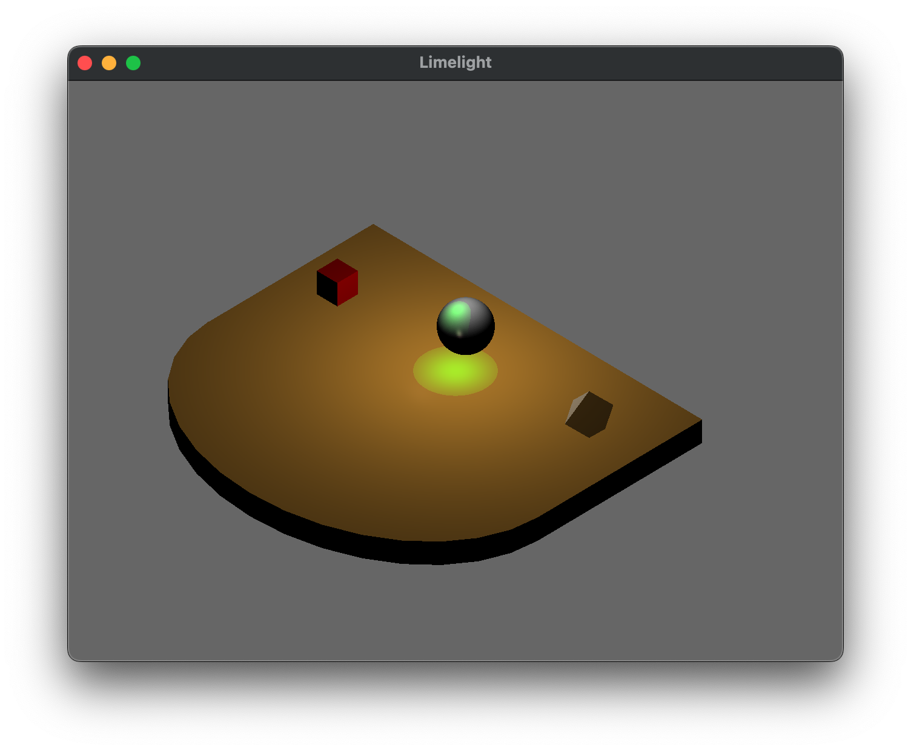
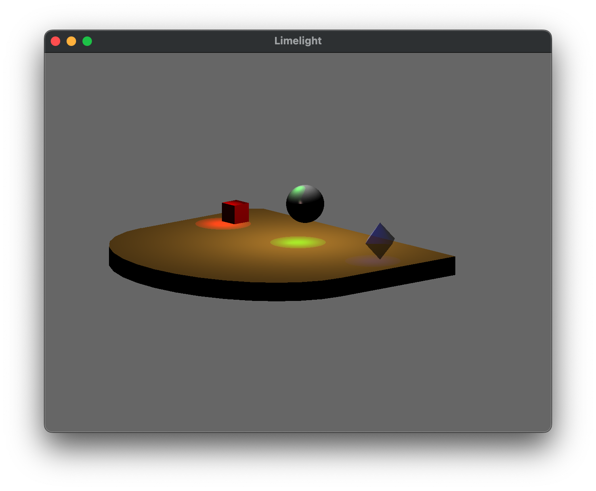

**Written Questions Due: Thursday, Oct 24th by 8:00 AM** (in class). Submit a **graded** pdf to Canvas by Sunday, Oct 22nd.

**Program Due:**

**Milestone 1: Friday, Oct 11th by 11:59 PM** 

**Milestone 2: Monday, Oct 28th by 11:59 PM** Late assignments will be penalized 20 points per day.

## Getting Started

Download [CS370\_Assign03\_Fa24.zip](src/CS370_Assign03_Fa24.zip), saving it into the **CS370\_Fa24** directory.

Double-click on **CS370\_Assign03\_Fa24.zip** and extract the contents of the archive into a subdirectory called **CS370\_Assign03\_Fa24**

Open CLion, select **CS370\_Fa24** from the main screen (you may need to close any open projects), and open the **CMakeLists.txt** file in this directory (**not** the one in the **CS370\_Assign03\_Fa24** subdirectory). Uncomment the line

```cpp
	add_subdirectory("CS370_Assign03_Fa24" "CS370_Assign03_Fa24/bin")
```

Finally, select **Reload changes** which should build the project and add **LimeLight** to the dropdown menu at the top of the IDE window.

## Written Questions

1.  Whenever large polygons are rendered with Gouraud lighting in OpenGL, instead of being bright in one area and dimmer in others, they are relatively uniform across the entire surface. Explain why this occurs and how this problem can be avoided. Furthermore, why are the light sources applied to *every* object instead of considering whether or not the light is blocked from one object to another, i.e. our lights do not cast *shadows*?

2.  For specular reflections, the equation in the Phong model involves the angle between the *reflection* vector and the *viewer* vector, i.e. **r** ⋅ **v**. To avoid this computation, if **v** is in the same plane as **l**, **n**, and **r** we can compute the *halfway vector* (the vector that is halfway between **l** and **v**, see hint below) as

    > **h** = (**l** + **v**)/(\|**l** + **v**\|)
    >
    > Show that the angle ψ between **n** and **h** is *half* the angle φ between **r** and **v**. In otherwords, show
    >
    > > 2 ψ = φ
    >
    > Note that this means that since we already have the vectors **n**, **l**, and **v** from the application, we can approximate the specular term without computing **r** but instead just compute **h** and find **n** ⋅ **h**.

    > **Hint:** Recall that the angle of incidence (θ between **l** and **n**) equals the angle of reflection (θ between **n** and **r**) and the vector **h** is *halfway* between **l** and **v**.
	>
	> 
	>

3. Assume that at a given pixel in the framebuffer that contains color channel values (0.1f, 0.4f, 0.7f, 1.0f), we render *two* translucent objects with the following colors

    > - (0.7f, 0.3f, 0.4f, 0.6f)
    > - (0.4f, 0.2f, 0.8f, 0.4f)
    
> What is the final blended color for that pixel using blend factors

> - **GL\_SRC\_ALPHA**/**GL\_ONE\_MINUS\_SRC\_ALPHA**
> - **GL\_SRC\_ALPHA**/**GL\_ONE** 

### Programming assignment

Write a program that draws a 3D stage scene with three "actors" and several lights using OpenGL. A sample executable is included in the **demo** directory as either **LimeLightSolWin.exe**, **LimeLightSolMac-Intel**, or **LimeLightSolMac-Silicon**. The scene should include:

-   A stage which is a rectangular cube with an elliptical front.
-   Three "actors" on the stage consisting of a cube, sphere, and translucent octahedron.
-   A point light source shining directly down on the stage.
-   Three spotlights (one per "actor") shining on the stage. The lights should be above each actor and have different colors.
-   The following keyboard behavior:

    > -   'V' should toggle the cube sliding forward/backwards
    > -   'B' should toggle the sphere bouncing up/down
    > -   'N' should toggle the octahedron spinning/stopped
    > -   0 should toggle the point light on/off
    > -   1, 2, 3 should toggle the respective spotlights on/off

-   All animations should be system *independent*, i.e. time-based.
-   \<esc\> should quit the program.

### Hints

> There are additional models provided that can be used for the different actors, e.g. **octahedron.obj**, etc.
>
> Consider how to use the **half\_circle.obj** and **cylinder.obj** to create the stage edge.
>
> Create various interesting lights and materials for the objects, consider how to make a translucent material.
>
> A **lightOn[]** array is provided and passed to the shader to specify which lights to use for lighting effects (0 - off, 1 - on). Don't forget to set the corresponding element of the array as you add additional lights.
>
> **DEVELOP INCREMENTALLY**. For example, draw the geometry and attempt to add each spotlight individually.


## Grading Criteria

**The program MUST compile to receive any credit** (so develop incrementally).

**Milestone 1** - 35 points

-   Initialization (main): 5 points
-   Stage: 10 points
-   Stage material: 5 points
-   Point light source: 5 points
-   Sphere object: 5 points
-   Sphere material: 5 points

**Milestone 2** - 65 points

-   Stage edge: 10 points
-   Cube object: 5 points
-   Cube material: 5 points
-   Octahedron object: 5 points
-   Octahedron material: 5 points
-   Spotlights: 10 points
-   Transparency: 5 points
-   Animated objects: 10 points
-   Toggle spotlights: 5 points
-   Creativity: 5 points

*Be creative!* For example, enhance the geometry of the scene by making new objects in Blender, use additional animations, allow the colors of the lights to change, and/or provide enhanced shader lighting.

## Compiling and running the program

You should be able to build and run the program by clicking the small green arrow towards the right of the top toolbar.

> 

> 

To quit the program simply close the window.

## Submitting to Marmoset

When you are done, submit the assignment to the Marmoset server using the Terminal window in CLion (click **Terminal** at the bottom left of the IDE). Navigate to the directory using

<pre>
$ <b>cd CS370_Assign03_Fa24</b>
CS370_Fa24/CS370_Assign03_Fa24
$ <b>make submit_ms1</b>
</pre>

or

<pre>
$ <b>cd CS370_Assign03_Fa24</b>
CS370_Fa24/CS370_Assign03_Fa24
$ <b>make submit_ms2</b>
</pre>

Enter your [Marmoset](https://cs.ycp.edu/marmoset) username and password, if successful you should see

<pre>
######################################################################
              >>>>>>>> Successful submission! <<<<<<<<<

Make sure that you log into the marmoset server to manually
check that the files you submitted are correct.

Details:

         Semester:   Fall 2024
         Course:     CS 370
         Assignment: assign03_ms1

######################################################################
</pre>

**You are responsible for making sure that your submission contains the correct file(s).**

