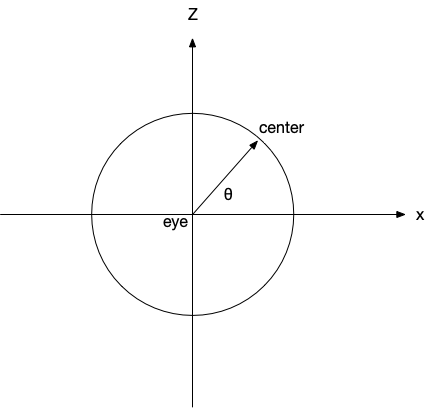
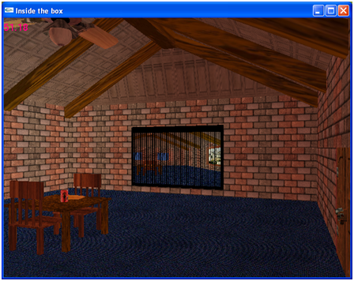

**Program Due:**

**Milestone 1: Thurs, Oct 17th in class**  7.5% - This milestone should demonstrate the basic geometry of the scene including the room walls and floor (but no ceiling for now) along with *at least* 3 other objects (placeholder objects can be used where more complex objects will eventually be located). An orthographic *third person* "birds-eye" view with an adjustable camera is acceptable at this point to see the entire room.

**Milestone 2: Thurs, Nov 14th in class**  7.5% - This milestone should contain *most* of the geometry that will appear in the final scene (although a few placeholder objects can remain). There should be a perspective *first person* camera with controls that allow movement throughout the room (but not necessarily with collision detection). Lighting effects with *at least* 2 different lights *including at least one spotlight* should be present.

**Final Presentation:** 85% - Your final project will be demonstrated during the final exam period for the course (see the [schedule](../labs/schedule.html)). MAKE SURE to complete the [self-evaluation form](CS370_Final_Project_eval.docx) and submit it with your project. Late assignments will **NOT** be accepted. Your entire project folder will be uploaded to a shared Google Drive after you have presented your demo.

**Evaluation Form** Word document for the [self-evaluation form](CS370_Final_Project_eval.docx).

## Getting Started

Download [CS370\_Project.zip](src/CS370_Project.zip), saving it into the **CS370_Fa24** directory.

Double-click on **CS370\_Project.zip** and extract the contents of the archive into a subdirectory called **CS370\_Project**

Open CLion, select **CS370_Fa24** from the main screen (you may need to close any open projects), and open the **CMakeLists.txt** file in this directory (**not** the one in the **CS370\_Project** subdirectory). Add the line

```cpp
	add_subdirectory("CS370_Project" "CS370_Project/bin")
```

Finally, select **Reload changes** which should build the project and add **house** to the dropdown menu at the top of the IDE window.

The skeleton project is primarily an empty source that simply draws a red cube viewed from an orthographic perspective (this may be useful as you create your geometry). There are shaders and routines provided for loading object models, building solid color buffers, building textures, and rendering color, material/lighting, and texture mapped objects. You may add any additional header files and resources (e.g. images, shaders, models) as desired.

## Programming assignment

The object of this project is to do a "walk through" of a room. You should create a room with various lighting and texture mapped objects such that the user can "walk through" the room to view it from different locations/orientations (the basis of a fps).

-   The room should have a floor, ceiling, and four walls (but need not be square).

    > -   Put "carpet" on the floor.
    > -   The other walls can simply be "painted" a solid color.

-   One of the walls should have a door made of "wood".

    > -   It can be a slab door.
    > -   Hinges and a door knob are optional.

-   An adjacent wall should have a window with a mini-blind.

    > -   Use 'O' (or 'o') to open and close the blinds revealing an outdoor scene through the window. (Hint: Use a texture mapped rectangle for the window pane.)

-   The opposite wall should have a large mirror that "reflects" the room.
-   The fourth wall should have a work of art hanging on it.
-   Place a "wooden" table and chairs in the center of the room.

    > -   Place a soda can on the table.
    > -   Place a translucent glass partially full of soda on the table.
    > -   Place a bowl of "spherical" fruit on the table.

-   Add a rotating ceiling fan on the ceiling.

    > -   A wall switch should toggle the fan via 'F' (or 'f'). You do not need to worry about proximity to the switch to operate it.

-   Add a light located at the center of the ceiling - roughly where the ceiling fan is.

    > -   A wall switch should toggle the light via 'L' (or 'l'). You do not need to worry about proximity to the switch to operate it.

-   The first person camera view should be able to

    > -   'W' (or 'w') - move forward in the CURRENT direction
    > -   'S' (or 's') - move backward in the CURRENT direction
    > -   'A' (or 'a') - turn left (azimuth)
    > -   'D' (or 'd') - turn right (azimuth)
    > -   'Z' (or 'z') - look up (elevation)
    > -   'X' (or 'x') - look down (elevation)

-   The camera should remain at a *fixed height* (i.e. "eye level").
-   The camera should *not* leave the room (although you do not need to worry about object avoidance within the room).
-   The field of view and frustum distance should be fixed *relative to the camera*.
-   All animations should be system *independent*, i.e. should be time-based, including fan rotation, blinds opening, etc.
-   All effects should be done in programmable shaders.

## Hints

**START EARLY!** You should be developing the scene incrementally such that you always have a working program prior to adding an additional feature.

Some embellishment suggestions:

-   Implement "mouselook" typical of standard fps (along with 'a' and 'd' strafing)
-   Use a 3D modelling program such as Blender to create more sophisticated geometry
-   Use enhanced programmable shader effects to add effects beyond default pipeline behavior.

Most of all - **HAVE FUN!** and be creative with this project.

### First Person Camera

In order to accomplish a first person camera where the controls move or rotate the camera along the *viewing direction*, we will use an approach similar to the spherical coordinates discussed in [Lab 6](../labs/lab06.html). We will use an azimuth angle, θ, to create the *center* point *relative* to the *eye* coordinates which will define a vector for the direction the camera is facing. Thus when we move forward or backward, we will simply update *eye* along this direction (with a corresponding update of *center*). Rotation will then involve an update of the angle θ and only a corresponding recalculation of *center* since it does not involve a change in camera position, i.e. *eye* doesn't change.

From a top down view

> 

we can compute the coordinates of *center* (whenever we adjust *eye* or change θ) as

> *center*<sub>x</sub> = *eye*<sub>x</sub> + cos(θ)
>
> *center*<sub>y</sub> = *eye*<sub>y</sub>
>
> *center*<sub>z</sub> = *eye*<sub>z</sub> + sin(θ)

To move along the *current direction*, we first compute a direction vector (which we can do using vector math operations) as

> *dir* = *center* - *eye*
    
Then we can update *eye* along *dir* by a step size Δ (again using vector math operations) as

> *eye* = *eye* + *dir*\*Δ

Since *eye* has changed, *center* will need to be updated as described above.

Adjusting the camera to look up/down can be done by adjusting the *y* component of *center* with an elevation angle (typically *without* adjusting the *y* component of *eye*).

Thus the steps to implement the first person camera are:

#### Global variables

> Set *eye* and θ to initially position the camera in the room and set the angle it is facing

#### Main

> Compute *center* based on *eye* and θ using the equations above

#### Keyboard callback

**if A/D**

> Update θ

**if W/S**

> Compute *dir* using the equation above
>
> Update *eye* using the equation above

Update *center* using the equations above

## Grading Criteria

**The program MUST compile to receive any credit** (so develop incrementally).

The program will be graded based on the number of features implemented along with the creativity used to implement each one.

-   Geometry: 15%
-   Animation: 15%
-   Lighting: 10%
-   Transparency: 5%
-   Texture mapping: 15%
-   Environment mapping (mirror): 5%
-   UI controls: 5%
-   Creativity and advanced effects: 30%

## Compiling and running the program

You should be able to build and run the program by selecting **house** in the dropdown box in the toolbar and clicking the small green arrow next to it.

> 

To quit the program simply close the window.

## Submitting

After you have demonstrated your final project, upload the entire project file to **Google Drive**. **RENAME THIS FOLDER** with your ycp username before uploading it to Google Drive.

**DO NOT** submit the project through Marmoset.

**You are responsible for making sure that your submission contains the correct file(s).**

