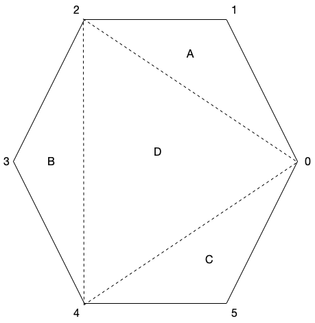
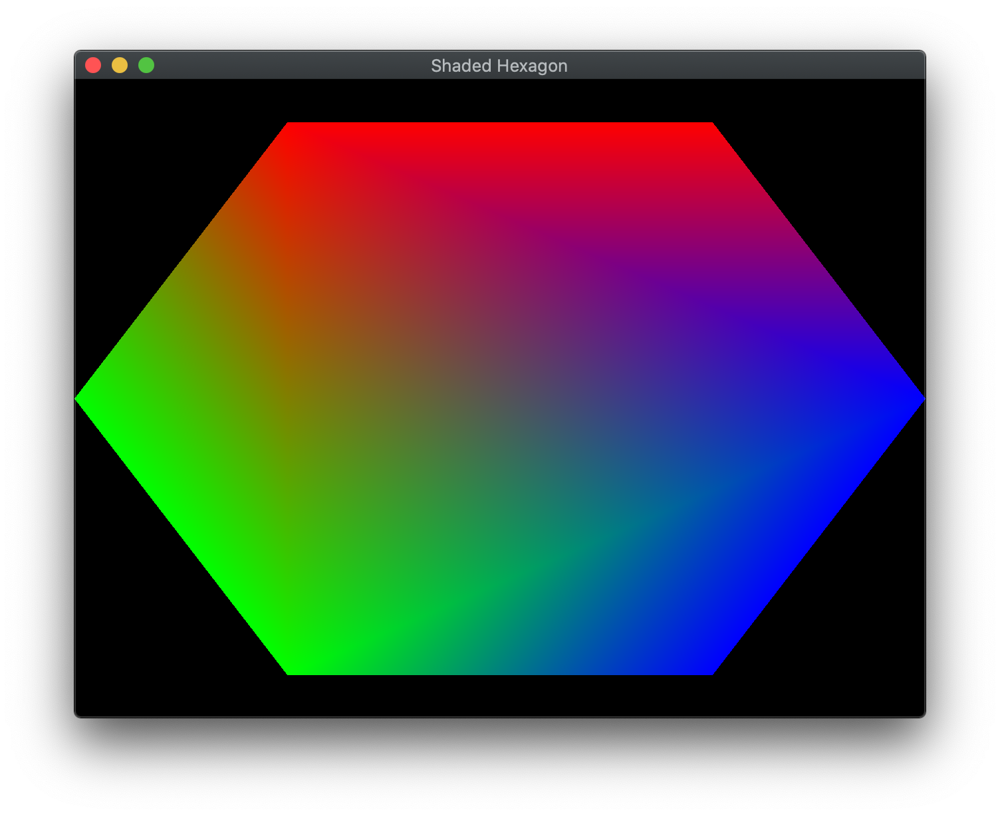

In the last lab we built some simple geometry and rendered it using a vertex buffer. However, the color of the rendered object was fixed (in the fragment shader). In OpenGL, we are able to define a color *per vertex* as an additional attribute along with the position. These colors will be similarly stored in a buffer and passed to the shaders. One nice property of the graphics system is that it will take care of *bi-linearly interpolating* colors between vertices thus creating a gradient fill effect automatically.

## Getting Started

Download [CS370\_Lab02.zip](src/CS370_Lab02.zip), saving it into the **CS370\_Fa23** directory.

Double-click on **CS370\_Lab02.zip** and extract the contents of the archive into a subdirectory called **CS370\_Lab02**

Open CLion, select **CS370\_Fa23** from the main screen (you may need to close any open projects), and open the **CMakeLists.txt** file in this directory (**not** the one in the **CS370\_Lab02** subdirectory). Uncomment the line

```cpp
	add_subdirectory("CS370_Lab02" "CS370_Lab02/bin")
```

Finally, select **Reload changes** which should build the project and add it to the dropdown menu at the top of the IDE window.

#### Solution

Download [CS370\_Lab02\_Solution.zip](sol/CS370_Lab02_Solution.zip), saving it into the **CS370\_Fa23** directory.

Double-click on **CS370\_Lab02\_Solution.zip** and extract the contents of the archive into a subdirectory called **CS370\_Lab02\_Solution**

Open CLion, select **CS370\_Fa23** from the main screen (you may need to close any open projects), and open the **CMakeLists.txt** file in this directory (**not** the one in the **CS370\_Lab02\_Solution** subdirectory). Uncomment the line

```cpp
	add_subdirectory("CS370_Lab02_Solution" "CS370_Lab02_Solution/bin")
```

Finally, select **Reload changes** which should build the project and add it to the dropdown menu at the top of the IDE window.

## Indexed Geometry

Since OpenGL uses *triangles*, i.e. faces, to render objects, for complicated objects vertices can be used by multiple faces. Rather than duplicate these vertices when we define the geometry, instead we will simply create a vector of *unique* vertices and then create a list of *indices* that specify which vertices to use for each face. Thus the elements of the *indices* vector will be *ivec3*, i.e. vectors consisting of three integer indices (triangles) for each face. In subsequent labs we will build geometry by loading models that represent objects in a similar fashion. Hence to create a hexagon, one possible *tessellation*, i.e. division into triangles is shown below

> 

While OpenGL has a mechanism for drawing indexed geometry, we will build the vertex buffer by creating a temporary vector which stores all the vertices using a loop to unpack the faces (which will be similar to how we will eventually load models). While this format uses more memory, it will provide additional needed flexibility to specify different auxiliary attributes per face for the same vertex.

### Tasks

- Add code to **build\_hexagon()** to define the *indices* vector (of type **ivec3** with a list of vertex indices for each of the four triangles shown in the hexagon figure above. **Note:** Indices start at 0 and be sure to use proper orientation for each triangle.

- Add code to **build\_hexagon()** to set the *obj* parameter index for the *numVertices* array. **Hint:** There are 3 vertices per face.

## Defining Colors

In OpenGL, colors are typically represented by four components in the range [0.0,1.0] - (r, g, b, a) - where *r*, *g*, and *b* are the red, green, and blue channels respectively, and *a* is the alpha channel which we will use later when we discuss alpha blending, i.e. transparency. While you may be familiar with the color channels being integers in the range [0,255] (for 24/32-bit colors), OpenGL provides a more flexible representation as a floating point number in the range [0.0, 1.0] which works with *any* color depth representation. Then OpenGL will convert the floating point number to a corresponding integer value per channel depending on the underlying system capabilities.

The interesting part about OpenGL colors is they are defined at each *vertex*. Thus, if vertices in the object have different colors, OpenGL's default behavior is to perform *bilinear interpolation* to create a shaded *gradient* between the vertices.

Similarly to storing vertex coordinate data into a buffer, we will use the same commands to create and store the color data into a separate buffer.
 
### Tasks

- Add code to **build\_hexagon()** to define the *colors* vector (of type **vec4**) where the first vertex is blue, the next two vertices are red, the next two vertices are green, and the last vertex is blue (note for all colors we simply set the alpha channel to 1.0). For example, blue for the first vertex would be defined as

```cpp
	// TODO: Define colors per vertex
	colors= {
		{0.0f, 0.0f, 1.0f, 1.0f},
	};
```

- Add code to **build\_hexagon()** to bind the *HexGradient* element from the *ColorBuffers* array. **Hint:** The *Color\_Buffer\_IDs* enum will contain a list of symbolic constants indexing the *ColorBuffers* array.

- Add code to **build\_hexagon()** to load data from the *obj_colors* vector into the color buffer. **Hint:** To get the size (in bytes) of the *colors* vector, use

```cpp
    sizeof(GLfloat)*colCoords*numVertices[obj]
```

> i.e. the number of bytes in a *GLfloat* times the number of coordinates per color (which in this case is 4) times the number of vertices in the object (stored in the numVertices array). To get a pointer to the elements from the vector, use the *.data()* method. Finally, set the usage flag to **GL\_STATIC\_DRAW** (indicating that we will not be changing the vertices later on).

- Add code to **draw\_color\_object()** to bind the *color* parameter element from the *ColorBuffers* array. **Note:** This structure will allow us to draw the same object with different colors.

- Add code to **draw\_color\_object()** to associate the shader variable location stored in *color\_vCol*, with *colCoords* coordinates per color (which is set to 4), that are of type **GL\_FLOAT**, without normalization, no stride (since the data is tightly packed), and no offset using

```cpp
    glVertexAttribPointer(color_vCol, colCoords, GL_FLOAT, GL_FALSE, 0, NULL);
```

- Add code to **draw\_color\_object()** to enable the attributes using the shader location *color\_vCol* using

```cpp
    glEnableVertexAttribArray(color_vCol);
```

- Add code to **build\_geometry()** to call the **build\_hexagon()** function passing the *Hexagon* constant.

## Compiling and running the program

You should be able to build and run the program by selecting **shadedHexagon** from the dropdown menu and clicking the small green arrow towards the right of the top toolbar.

At this point you should see a gradient filled hexagon.

> 

To quit the program simply close the window.

Congratulations, you have now rendered slightly more complex geometry.

Next we will learn how to manipulate our objects using *transformations*.
