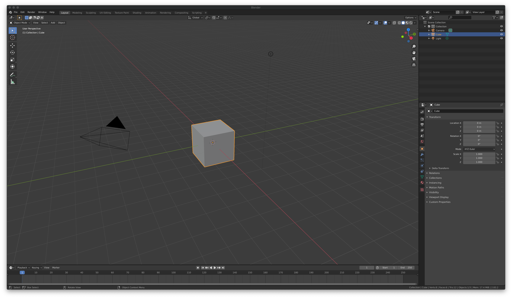
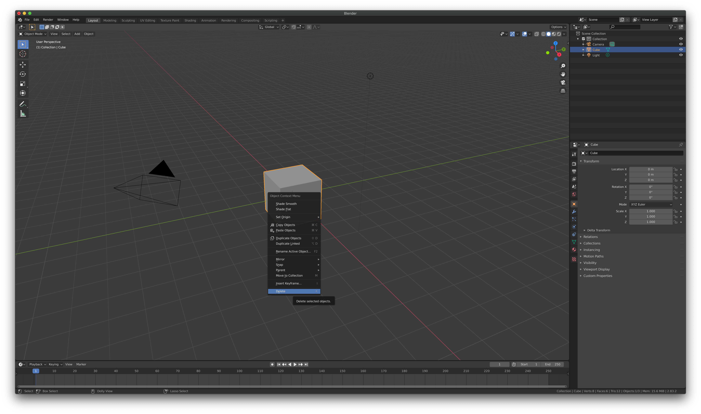
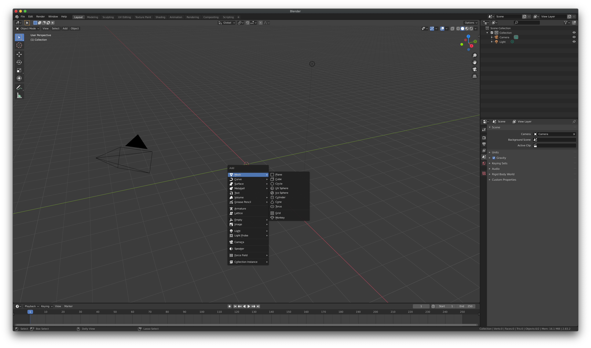
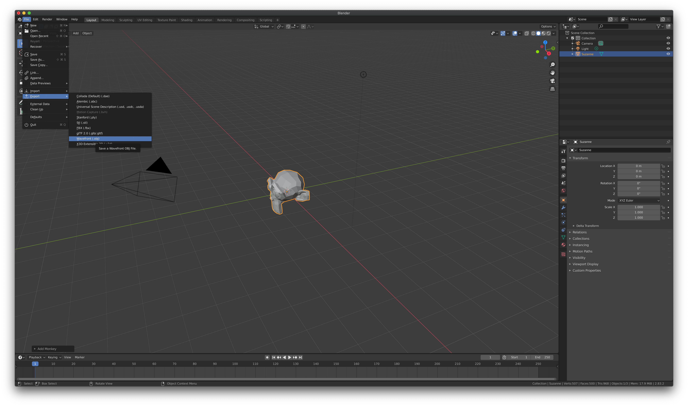
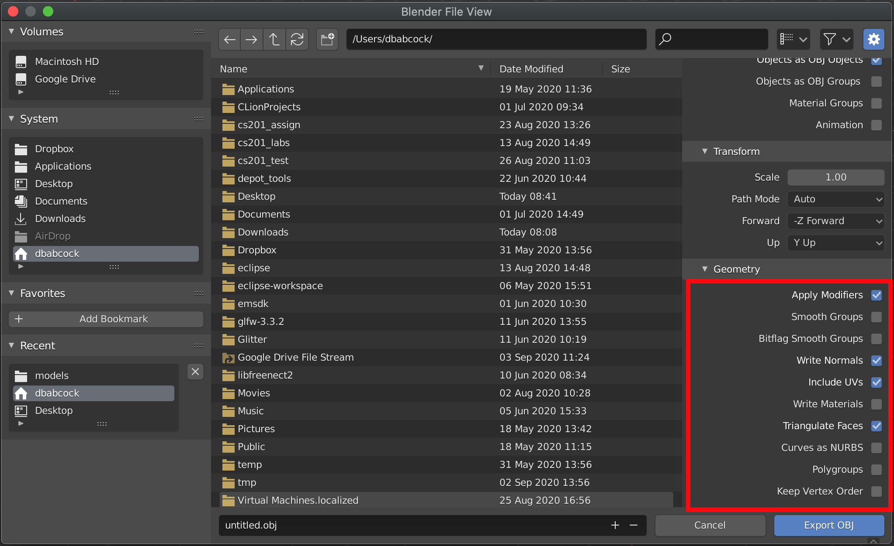
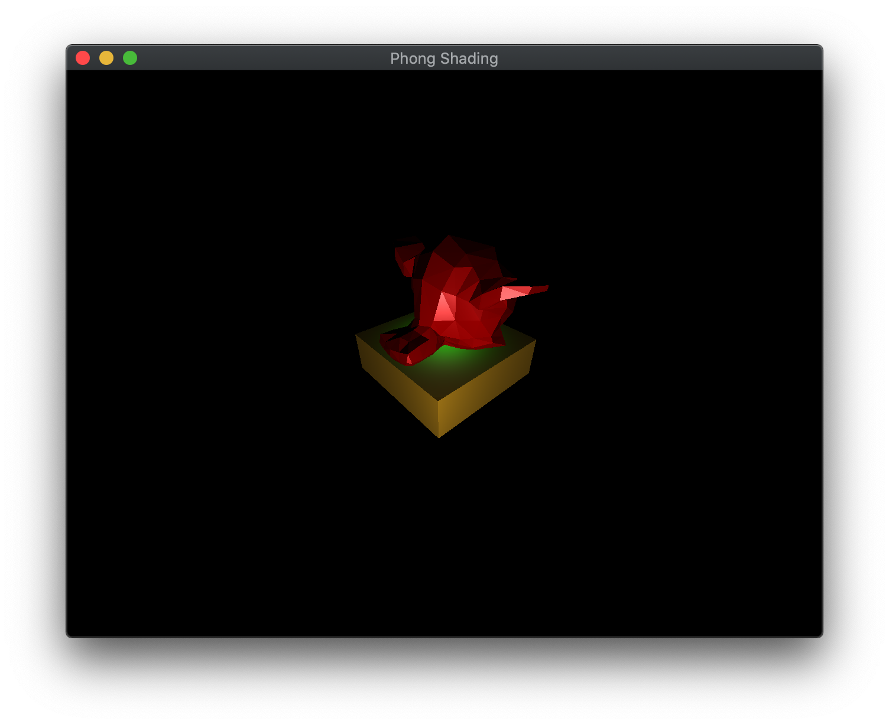

While it is convenient to use mesh files provided by external sources, we may want to make our own **.obj** files for objects to either create unique shapes, or to adjust size, orientation, and origin locations for basic geometric meshes. In this lab, we will see how to create a basic mesh shape in [Blender](www.blender.org) and export it to an **.obj** file that our basic model loader can load into our application.

## Getting Started

Download [CS370\_Lab12.zip](src/CS370_Lab12.zip), saving it into the **CS370\_Fa23** directory.

Double-click on **CS370\_Lab12.zip** and extract the contents of the archive into a subdirectory called **CS370\_Lab12**

Open CLion, select **CS370\_Fa23** from the main screen (you may need to close any open projects), and open the **CMakeLists.txt** file in this directory (**not** the one in the **CS370\_Lab12** subdirectory). Uncomment the line

```cpp
	add_subdirectory("CS370_Lab12" "CS370_Lab12/bin")
```

Finally, select **Reload changes** which should build the project and add it to the dropdown menu at the top of the IDE window.

#### Solution

Download [CS370\_Lab12\_Solution.zip](sol/CS370_Lab12_Solution.zip), saving it into the **CS370\_Fa23** directory.

Double-click on **CS370\_Lab12\_Solution.zip** and extract the contents of the archive into a subdirectory called **CS370\_Lab12\_Solution**

Open CLion, select **CS370\_Fa23** from the main screen (you may need to close any open projects), and open the **CMakeLists.txt** file in this directory (**not** the one in the **CS370\_Lab12\_Solution** subdirectory). Uncomment the line

```cpp
	add_subdirectory("CS370_Lab12_Solution" "CS370_Lab12_Solution/bin")
```

Finally, select **Reload changes** which should build the project and add it to the dropdown menu at the top of the IDE window.

For this lab you will also need to install [Blender](www.blender.org).

## Adding a Mesh

When Blender is first opened, there is a default cube centered at the origin.

> 

To delete this stock object, simply right-click and select **Delete**.

> 

Then to add a new mesh (at the origin) simply hit \<Shift\>-A which should pop up the add dialog and select Mesh which should pop out a list of mesh objects that are built in to Blender.

> 

After the mesh has been added, there may be a dialog box in the lower left portion of the main window that will allow configuration of the added mesh typically including the default size, location, and orientation.

Some additional meshes can be obtained by choosing **Edit->Preferences->Add-ons->Add Mesh: Extra Objects** from the menu bar.

### Multiple Meshes

You can also combine several meshes together, which is necessary for our model loader to work properly, by

- Add all the desired meshes and move them into their proper places/sizes/orientations

- Select all the meshes using Shift-(left click)

- After all the meshes are selected, hit CTRL-J to combine the meshes into a single one that can be exported

### Tasks

- Open up Blender and delete the default cube

- Add the **Monkey** mesh

- In the configuration dialog, change the size to 3 m.

- In the configuration dialog, rotate about the x-axis by 90 degrees (since the default orientation is with the z-axis being up).

## Exporting a Mesh

To export the mesh, from the menu bar select **File->Export->Wavefront (.obj) (legacy)**

> 

Select the location where you want to export the file and the name for the file. In the lower right panel, make sure in the Transform tab that Up is set to **Y up**. Then expand the Geometry tab and make sure the selections match the figure below, i.e. only **Apply Modifiers**, **Write Normals**, **Include UVs**, and **Triangulate Faces** are checked, i.e. **UNCHECK** **Write Materials**. This will produce a file that can be imported by the basic model loader we are using.

> 

### Tasks

- Export the mesh to the **models** directory in **CS370\_Lab12** naming the file **monkey.obj**

- Add code at the top of the file to create a variable named **monkeyFile** of type **const char \*** and assign it to **../models/monkey.obj**

- Add code to **build\_geometry()** to import the monkey model using the *Monkey* constant using the **load\_model()** function.

- Add code to **render\_scene()** to draw the monkey model using **draw\_mat\_object()**  using the *Monkey* and *RedPlastic* constants which should render it in the application.

This lab is only to create simple geometry meshes in Blender that can be loaded into our OpenGL applications using our simple model loader. For more information about using all the features of Blender to create more sophisticated models, one place to start is the [Blender tutorials](https://www.blender.org/support/tutorials/).

## Compiling and running the program

You should be able to build and run the program by selecting **blenderMonkey** from the dropdown menu and clicking the small green arrow towards the right of the top toolbar.

At this point you should see a cube and Blender monkey with lighting.

> 

To quit the program simply close the window.

Congratulations, you have now created a simple model in a modeling program and imported it into an application.

Next we will greatly enhance the visual appearance of our objects using texture mapping.
