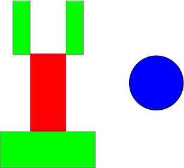
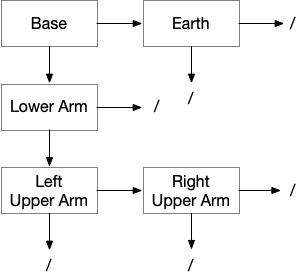
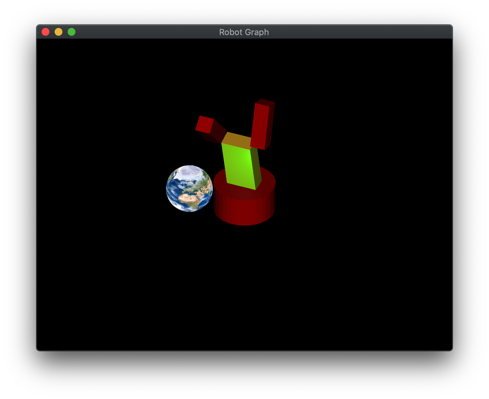

Now that we render geometry with both lighting and texture mapping, we will explore a nice way to *organize* the objects into our scene, particularly those that have a direct relationship to each other. For example, the position of your hand is related to the position of your arm which is related to the position of your body. Thus rather than having to continually recompute the *absolute* position of each part, we would like to create a mechanism for simply keeping track of the *relative* positioning of each part with respect to the other parts. Therefore, when one part moves, e.g. your body, those parts connected to it will automatically move with it. We can accomplish this by constructing a tree structure known as a *scene graph*. In the scene graph, every object will become a *node* which will contain the local transformations for that particular object as well as any necessary rendering components. The tree then provides a convenient mechanism for *preserving* the transformations from level to level, hence objects that are related will have the same transformations applied to them *automatically*. Once the tree has been constructed, rendering the scene is simply a matter of *traversing* the tree using a *depth first* approach (actually any part of the tree can likewise be rendered by starting at the desired node). This structure allows for simple addition/removal of nodes from the scene by manipulation of the relationships between the nodes. Also note that in this lab we will employ multiple shaders such that some nodes will be illuminated by lighting while others will be texture mapped.

## Getting Started

Download [CS370\_Lab14.zip](src/CS370_Lab14.zip), saving it into the **CS370\_Fa23** directory.

Double-click on **CS370\_Lab14.zip** and extract the contents of the archive into a subdirectory called **CS370\_Lab14**

Open CLion, select **CS370\_Fa23** from the main screen (you may need to close any open projects), and open the **CMakeLists.txt** file in this directory (**not** the one in the **CS370\_Lab14** subdirectory). Uncomment the line

```cpp
	add_subdirectory("CS370_Lab14" "CS370_Lab14/bin")
```

Finally, select **Reload changes** which should build the project and add it to the dropdown menu at the top of the IDE window.

#### Solution

Download [CS370\_Lab14\_Solution.zip](sol/CS370_Lab14_Solution.zip), saving it into the **CS370\_Fa23** directory.

Double-click on **CS370\_Lab14\_Solution.zip** and extract the contents of the archive into a subdirectory called **CS370\_Lab14\_Solution**

Open CLion, select **CS370\_Fa23** from the main screen (you may need to close any open projects), and open the **CMakeLists.txt** file in this directory (**not** the one in the **CS370\_Lab14\_Solution** subdirectory). Uncomment the line

```cpp
	add_subdirectory("CS370_Lab14_Solution" "CS370_Lab14_Solution/bin")
```

Finally, select **Reload changes** which should build the project and add it to the dropdown menu at the top of the IDE window.

## Scene Graph Nodes

For the tree structure we will be using a *child/sibling* tree structure. The base node structure contains (among other things) two transformation matrices, *pointers* to connecting nodes, and an abstract draw method as follows:

```cpp
    // Object properties
    vmath::mat4 BaseTransform;
	vmath::mat4 ModelTransform;
	BaseNode *Sibling;
	BaseNode *Child;

    virtual void draw(vmath::mat4 proj, vmath::mat4 cam, vmath::mat4 trans) = 0;
```

The *BaseTransform* will be the static transformation of the template object, e.g. scaling, and the *ModelTransform* will be the dynamic transformation that will include positioning *relative to the parent node* as well as any changing local transformations, e.g. variable rotation. The **draw()** method will take three matrices, *proj* which is the projection matrix, *cam* which is the camera matrix, and *trans* which is the parent's dynamic transformation matrix. 

Subclasses of **BaseNode** will then create specific implementations for different rendering mechanisms adding any additional fields and providing a concrete implementation of the **draw()** method. For example, **MatNode** will render objects using lighting and thus will have fields for the normals, lights, and materials to use in the **draw()** method. The subclass nodes also include various setter methods for these additional fields.

**Note:** For efficiency, the nodes only store references to the various buffer objects such that the same buffer data can be used by similar nodes.

For this lab we will be constructing a simple robot with a circular base, a single lower arm, and two upper arms along with a separate spinning Earth sphere.

> 

A diagram for the robot as a scene graph would be

> 

Note: Whenever a node does not have a child or sibling, its corresponding field should be set to **NULL**. A more general technique would be to *dynamically allocate* nodes as needed, i.e. similar to maintaining a linked-list, when the number of objects in the scene is variable (e.g. projectiles).

To help build different types of nodes, two utility functions are provided which take care of storing references to all the corresponding shader information. 

To create a node that is rendered with lighting and materials:

```cpp
void build_lighting_node(MatNode& node, GLuint obj, GLuint material, GLboolean transparent, mat4 base_trans);
```

where *node* is a reference to the node to create, *obj* is a constant from the *VAO\_IDs* enum specifying the type of object geometry, *material* is a constant from the *MaterialNames* enum specifying the material to use, *transparent* is a boolean specifying whether or not the object uses transparency, and *base\_trans* is a **mat4** specifying the node's base transformation.

To create a node that is rendered with texture mapping:

```cpp
void build_texture_node(TexNode& node, GLuint obj, GLuint texture, mat4 base_trans);
```

where *node* is a reference to the node to create, *obj* is a constant from the *VAO\_IDs* enum specifying the type of object geometry, *texture* is a constant from the *Textures* enum specifying the texture to use, and *base\_trans* is a **mat4** specifying the node's base transformation.

After the node is created, we can use the **.set\_update\_transform()** method for the node to specify it's update transform and the **.attach\_nodes()** method to specify the child and sibling references.
 
So for example for the base node (assuming it is **MatNode base** that is a *Cylinder* using *RedPlastic* without transparency and a lower arm child node named **MatNode lower\_arm**) could be created as follows

```cpp
    build_lighting_node(base, Cylinder, RedPlastic, false, scale(vec3(BASE_RADIUS, BASE_HEIGHT, BASE_RADIUS)));
    base.set_update_transform(rotate(theta, vec3(0.0f, 1.0f, 0.0f)));
    base.attach_nodes(&lower_arm, NULL);
```

### Tasks

- Add code to **build\_scene\_graph()** to initialize the fields of the four lighting/material nodes (simply set the update transform to **mat4().identity()** for now)

> -   **Base** - Use the *Cylinder* object, *RedPlastic* material, the base transformation to scale the cylinder by **BASE\_RADIUS** in *x* and *z* and **BASE\_HEIGHT**, set the sibling pointer to **NULL**, and the *child* pointer to the lower arm. **Hint:** Use the code above as a starting point.
> -   **Lower Arm** - Construct the lower arm similar to the base but using the *Cube* object, *Brass* material, and setting the base transformation to scale it to **LOWER\_WIDTH**, **LOWER\_HEIGHT**, and **LOWER\_DEPTH** translated up in *y* by **LOWER\_HEIGHT/2** (so it is positioned on the x-z plane), and make the *child* the left upper arm.
> -   **Upper Arms** - Construct the upper arms similar to the lower arm again using the *Cube* object, *RedPlastic* material, but scaled by **UPPER\_WIDTH**, **UPPER\_HEIGHT** and **UPPER\_DEPTH** translated up in *y* by **UPPER\_HEIGHT/2** (so it is positioned on the x-z plane), and make the right upper arm a *sibling* of the left upper arm. 
>
> Set empty node pointers to **NULL** and remember to use **&** to pass the *address* of a connecting node in the **attach\_node** methods.

## Local Transformation Updates

Once we have created the scene graph structure by setting the various node fields, we need to set the dynamic local update transformations for each node to locate it *relative* to its *parent* using the **set\_update\_transform()** method inherited from the base class.

**Note:** We will need to call this method again *whenever* the local transformation needs updating, e.g. during animation or user input.

### Tasks

- Add code to **build\_scene\_graph()** to update all the nodes using the **set\_update\_transform()** node method. In particular:

> -   **Base** - rotate by angle **theta** about the *y*-axis.
> -   **Lower arm** - translate up by **BASE\_HEIGHT** (to position it on top of the base) and rotate by angle **phi** about the *x*-axis.
> -   **Upper arms** - translate up by **LOWER\_HEIGHT** (to position it on top of the lower arm) and over in *x* by **±(LOWER\_WIDTH + UPPER\_WIDTH)/2** (to position them on the left/right side of the lower arm) and rotate by angle *left/right\_psi* about the *x*-axis.

- Add code to **key\_callback( )** to call the same update functions for the appropriate nodes when the user presses the corresponding keys. **NOTE:** This step is extremely important if you wish any user input to affect the scene.

## Rendering the Scene Graph

Finally we can render the scene by simply *traversing* the tree in a *depth-first* fashion starting at a *root node* using the traversal routine **traverse\_scene\_graph()** given by

```cpp
void traverse_scene_graph(BaseNode *node, mat4 baseTransform) {
    mat4 model_matrix;

    // Stop when at bottom of branch
    if (node == NULL) {
        return;
    }

    // Apply local transformation and render
    model_matrix = baseTransform*node->ModelTransform;

    node->draw(proj_matrix, camera_matrix, model_matrix);

    // Recurse vertically if possible (depth-first)
    if (node->Child != NULL) {
        traverse_scene_graph(node->Child, model_matrix);
    }

    // Remove local transformation and recurse horizontal
    if (node->Sibling != NULL) {
        traverse_scene_graph(node->Sibling, baseTransform);
    }
}
```

### Tasks

- Add a call to **traverse\_scene\_graph()** in **render\_scene( )** to render the scene along with the identity matrix as the initial *baseTransform* using **mat4().identity()**. Make sure to pass the *address* of the root node, which in this case is **base** (i.e. you will need the **&** since the function parameter is a *pointer*).

## Adding Other Objects to a Scene Graph

To place additional *independent* objects into a scene graph, we can simply make them *siblings* of the root node.

### Tasks

- Add code to **build\_scene\_graph()** to create the *earth* texture node using the *Sphere* object, *Earth* texture, the base transformation to scale the sphere by 1.5f in all dimensions, and set the update tranformation to translate by 3.0f in *y* and 5.0f in *z* and rotate by *earth\_angle* about the *y* axis.
- Add code in **build\_scene\_graph()** to change the *sibling* of the base to the *earth* node.
- Add code to **main()** in the render loop to set the new update transform after *earth\_angle* has been updated.

## Compiling and running the program

You should be able to build and run the program by selecting **robotGraph** from the dropdown menu and clicking the small green arrow towards the right of the top toolbar.

At this point you should see a robot with a spinning textured earth. You can manipulate the robot using a,d to rotate the base, w,s to rotate the lower arm, n,m ,. to rotate the left/right upper arms, and spacebar to toggle the spotlight. **Note:** Adjusting the robot does *not* affect the earth.

> 

To quit the program simply close the window.

Congratulations, you have now written an application using a scene graph.

Next we will investigate how to add shadows into our scenes using a multipass rendering technique.
