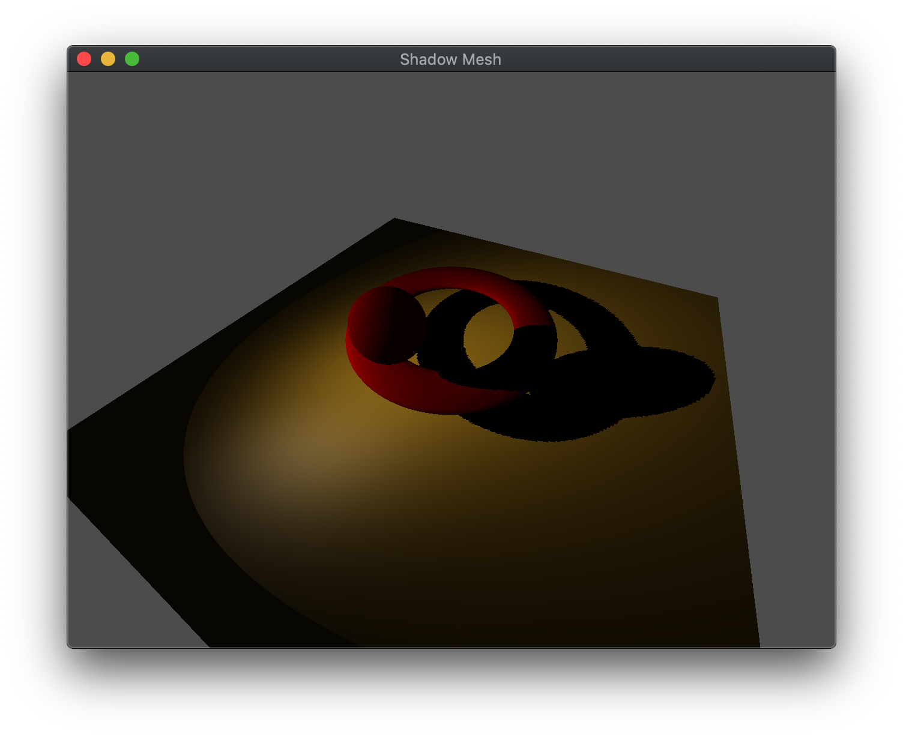
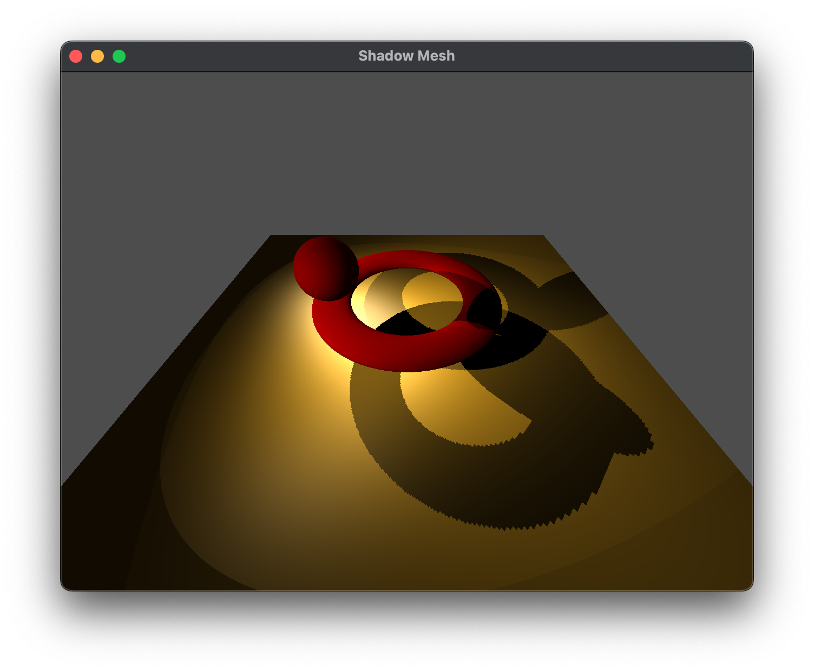

The basic graphics pipeline does not maintain any global information (except depth information for hidden surface removal), i.e. each object is rendered independently of other objects. With regards to lighting, this means that objects do not cast *shadows* on other objects despite being *in front* of other objects with respect to a light source. However, we can create a shadow effect using a *mulit-pass* rendering technique, i.e. rendering the objects in the scene multiple times, where an initial pass will be from the perspective of the *light source* creating a depth shadow map that will be stored in a *texture*. This texture can then be used during the normal rendering from the camera to determine if a pixel is in shadow (i.e. further than the closest pixel to the light) and adjust the color accordingly. The key to this technique is creating a second depth buffer and setting an appropriate projection for the light source.

## Getting Started

Download [CS370\_Lab15.zip](src/CS370_Lab15.zip), saving it into the **CS370\_Fa23** directory.

Double-click on **CS370\_Lab15.zip** and extract the contents of the archive into a subdirectory called **CS370\_Lab15**

Open CLion, select **CS370\_Fa23** from the main screen (you may need to close any open projects), and open the **CMakeLists.txt** file in this directory (**not** the one in the **CS370\_Lab15** subdirectory). Uncomment the line

```cpp
	add_subdirectory("CS370_Lab15" "CS370_Lab15/bin")
```

Finally, select **Reload changes** which should build the project and add it to the dropdown menu at the top of the IDE window.

#### Solution

Download [CS370\_Lab15\_Solution.zip](sol/CS370_Lab15_Solution.zip), saving it into the **CS370\_Fa23** directory.

Double-click on **CS370\_Lab15\_Solution.zip** and extract the contents of the archive into a subdirectory called **CS370\_Lab15\_Solution**

Open CLion, select **CS370\_Fa23** from the main screen (you may need to close any open projects), and open the **CMakeLists.txt** file in this directory (**not** the one in the **CS370\_Lab15\_Solution** subdirectory). Uncomment the line

```cpp
	add_subdirectory("CS370_Lab15_Solution" "CS370_Lab15_Solution/bin")
```

Finally, select **Reload changes** which should build the project and add it to the dropdown menu at the top of the IDE window.

## Building a Shadow Buffer and Texture

To produce the shadow map, we will allocate a new framebuffer (with a depth buffer) that will be used to render the scene into from the perspective of the light. Furthermore, we will create and bind a texture to this framebuffer and write the depth values into this texture. Since we are only interested in the *depth* values, we will disable rendering colors to this framebuffer as well. The code to perform this setup is

```cpp
void build_shadows( ) {
    // Generate new framebuffer and corresponding texture for storing shadow distances
    glGenFramebuffers(1, &ShadowBuffer);
    glGenTextures(1, &TextureIDs[ShadowTex]);
    // Bind shadow texture and only store depth value
    glBindTexture(GL_TEXTURE_2D, TextureIDs[ShadowTex]);
    glTexImage2D(GL_TEXTURE_2D, 0, GL_DEPTH_COMPONENT, 1024, 1024, 0, GL_DEPTH_COMPONENT, GL_FLOAT, NULL);
    glTexParameteri(GL_TEXTURE_2D, GL_TEXTURE_MIN_FILTER, GL_NEAREST);
    glTexParameteri(GL_TEXTURE_2D, GL_TEXTURE_MAG_FILTER, GL_NEAREST);
    glTexParameteri(GL_TEXTURE_2D, GL_TEXTURE_WRAP_S, GL_REPEAT);
    glTexParameteri(GL_TEXTURE_2D, GL_TEXTURE_WRAP_T, GL_REPEAT);
    glBindFramebuffer(GL_FRAMEBUFFER, ShadowBuffer);
    glFramebufferTexture2D(GL_FRAMEBUFFER, GL_DEPTH_ATTACHMENT, GL_TEXTURE_2D, TextureIDs[ShadowTex], 0);
    // Buffer is not actually drawn into since only for creating shadow texture
    glDrawBuffer(GL_NONE);
    glReadBuffer(GL_NONE);
    glBindFramebuffer(GL_FRAMEBUFFER, 0);
}
```

which will create a framebuffer *ShadowBuffer* and the corresponding texture *ShadowTex*. Notice that we have created a 1024x1024 resolution texture to provide higher resolution for the shadow map to more accurately capture object edges.

## Creating the Shadow Map

To create the shadow map, we will render similarly to our usual **display()** routine except with a projection and camera matrix from the perspective of the light source we want to use for the shadows. We will select the shadow buffer to render into and render the scene to create the shadow map. The key to generating proper shadows is orienting the shadow "camera" in the proper direction and defining a proper shadow "viewing volume" for the light source. For *directional* lights, orthographic viewing volumes are often used since the projectors for these viewing volumes are parallel corresponding to the parallel light rays of a directional light. For *point* and *spot* lights, frustum viewing volumes are used since the light rays emanate from the light location. For either projection, it is important for depth buffer accuracy to place the near and far clipping planes as close together as possible while capturing the objects that will be affected by the shadowing.

One other consideration when rendering the shadow map, is unlike our regular rendering, we will want to cull *front faces*. This is done to avoid an artifact known as *peter panning* where objects can appear detached from their shadows (see [LearnOpenGL](https://learnopengl.com/Advanced-Lighting/Shadows/Shadow-Mapping)).

### Tasks

- Add code to **create\_shadows()** to set the *shadow\_proj\_matrix* to a **frustum** with extents (-1,1,-1,1,1,20)

- Add code to **create\_shadows()** to set the *shadow\_camera\_matrix* using **lookat** using the position of *Lights[0]* as the eye vector, the sum of *Lights[0]* position and direction (which defines a point in front of the light location along the light direction) as the center vector, and the usual (0,1,0) as the up vector. **Note:** **DO NOT** change the *eye* and *center* variables for the regular camera, instead it might be convenient to create local **vec3** variables.

- Add code to **create\_shadows()** to set the *shadow* flag to **true** (to have **render\_scene()** use the shadow shaders), call **render\_scene()**, then set the *shadow* flag back to **false**.

- Add code to **main()** in the rendering loop to call **create\_shadows()** *before* **display()**. Cull front faces by calling **glCullFace(GL\_FRONT)** immediately before creating the shadows and then reset it using **glCullFace(GL\_BACK)** immediately after creating the shadows.

**Note:** Observe how the viewport is adjusted to match the shadow map resolution when rendering the scene from the light (and then set back to the normal viewport for the display window) and the shadow buffer is bound as the framebuffer. Also, sometimes it can be tricky to set the shadow camera and projection matrices correctly, so a *debug\_program* shader has been provided (using **debugShadow.vert** and **debugShadow.frag**). This debug shader can be used to help adjust the shadow camera and projection matrices until the desired depth map is obtained by rendering the shadow map directly onto the screen by uncommenting the **renderQuad()** call in the main rendering loop and commenting out the **display()** call.

## Rendering the Scene with Shadows

Once the shadow map is created, we reset the projection and camera matrices for the viewer (in **display()**). We then simply draw the objects using **draw\_mat\_shadow\_object()** which contains logic to select the appropriate rendering shader and set corresponding shader variables, e.g. the light and material buffers for the lighting shader, and *bind* the shadow map which will be used in the shader to perform the shadow depth test.

### Tasks

- Add code to **render\_scene()** to call **draw\_mat\_shadow\_object()** passing the *Cube* and *Brass* constants to draw the cube for the table.

- Add code to **render\_scene()** to call **draw\_mat\_shadow\_object()** passing the *Sphere* and *RedPlastic* constants to draw the revolving sphere.

- Add code to **render\_scene()** to call **draw\_mat\_shadow\_object()** passing the *Torus* and *RedPlastic* constants to draw the torus.

**Note:** Additional code has been provided to draw a small sphere illustrating where the light source is within the scene.

## Shadow Testing in the Shader

The final step to incorporating shadows involves comparing the depth of the closest object to the light, stored in the shadow map, with the depth of each object *from the light*. We will compute the distance for the object in the vertex shader using the light projection and camera matrices on the transformed vertex position which will then be passed (and interpolated) to the fragment shader. We can then normalize the projected coordinates in the fragment shader and use the **.xy** coordinates as the *texture coordinate* to use to sample the shadow map since they will represent the texel location of the rendered object. The **.r** field of the sampled "color" will give the depth of the closest object to the light which we can compare to the object depth to determine if the fragment is in shadow or not.

One consideration that we need to account for is the precision of the depth calculations which can cause some fragments to be in shadow while others are not producing a strange Moire pattern on the objects. Thus to avoid this artifact effect, known as "shadow acne" (see [LearnOpenGL](https://learnopengl.com/Advanced-Lighting/Shadows/Shadow-Mapping)), we can slightly offset the depth of the surface by a small bias so the compared depth will be slightly less than the value stored in the shadow map for objects that are not in shadow (i.e. the closest objects).

A shader function to perform the depth comparison (see [LearnOpenGL](https://learnopengl.com/Advanced-Lighting/Shadows/Shadow-Mapping)) is

```cpp
float ShadowCalculation(vec4 fragLightPos) {
     // Normalize light position [-1, 1]
     vec3 projCoords = fragLightPos.xyz/fragLightPos.w;

     // Convert to depth range [0, 1]
     projCoords = projCoords*0.5 + 0.5;

     float closestDepth = texture(shadowMap, projCoords.xy).r;
     float curDepth = projCoords.z;

     float bias = 0.005;
     return curDepth - bias > closestDepth ? 1.0f : 0.0f;
}
```

Finally, once we know if a fragment is in shadow, we can attenuate the color of that fragment accordingly. 

### Tasks

- Add code in **phongShadow.vert** in **main()** to compute the transformed vertex *Position* in light space

```cpp
    LightPosition = light_proj_matrix*(light_cam_matrix*Position);
```

- Add code in **phongShadow.frag** to add the **ShadowCalculation()** function code given above.

- Add code in **phongShadow.frag** in **main()** to perform the shadow calculation using *LightPosition* received from the vertex shader

```cpp
     float shadow = 1.0 - ShadowCalculation(LightPosition);
```

- Add code in **phongShadow.frag** in **main()** to attenuate the computed light color with *shadow* (which will either be 0.0 if the fragment is in shadow or 1.0 if not)

```cpp
     fragColor = shadow*vec4(min(rgb,vec3(1.0)), 1.0f);
```

## Compiling and running the program

You should be able to build and run the program by selecting **shadowMesh** from the dropdown menu and clicking the small green arrow towards the right of the top toolbar.

At this point you should see a torus and revolving sphere that casts a shadow on the torus and ground. 

> 

To quit the program simply close the window.

Congratulations, you have now written an application incorporating shadows.

It is possible to repeat this effect with multiple lights by having separate depth buffer textures, rendering the scene from each light source, and then combining the shadow effects for each object. Obviously the more lights there are, the greater the performance penalty for each subsequent rendering stage. Here is a sample solution with two lights

[CS370\_Lab15\_MultiLight\_Solution.zip](sol/CS370_Lab15_MultiLight_Solution.zip)

You will need to add the following line to your **CMakeLists.txt** file in the **CS370\_Fa23** directory (**not** the one in the **CS370\_Lab15\_MultiLight\_Solution** subdirectory).

```cpp
	add_subdirectory("CS370_Lab15_MultiLight_Solution" "CS370_Lab15_MultiLight_Solution/bin")
```

> 

Next we will investigate how to add mirrors into the scene.
